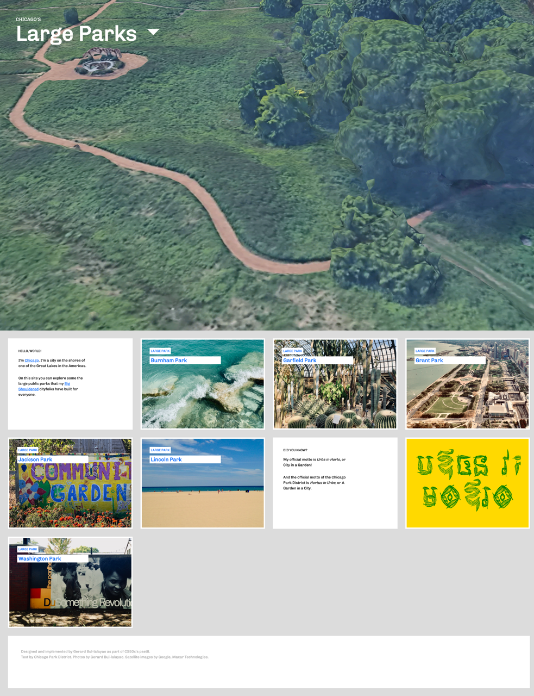
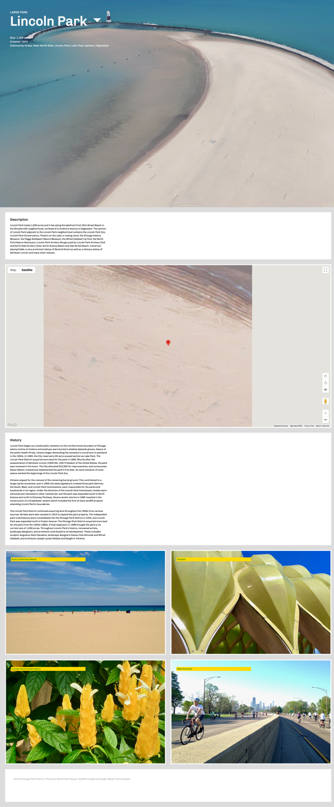
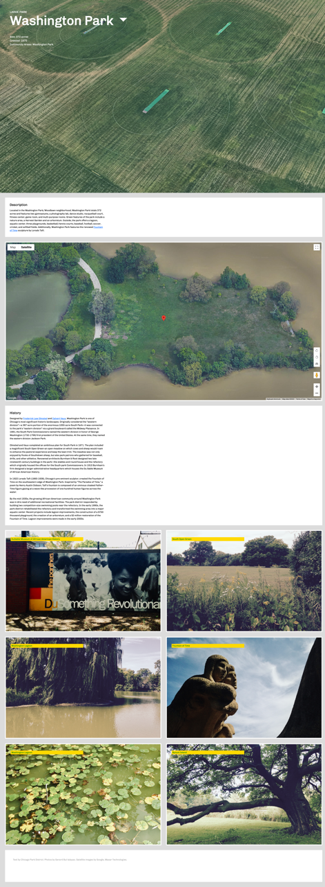

# Large Parks

A website for large public parks in Chicago

## Description

> [!NOTE]
> ALL CONTENTS IN THIS REPO ARE FOR EDUCATIONAL PURPOSES ONLY.

_Large Parks_ is a simple static website for large public parks overseen by the Chicago Park District.


More screenshots below.

## Table of Contents

* [Description](#description)
* [Features](#features)
* [Project Structure](#project-structure)
* [Prerequisites](#prerequisites)
* [Getting Started](#getting-started)
  * [Dependencies](#dependencies)
  * [Installation](#installation)
  * [Configuration](#configuration)
  * [Usage](#usage)
* [Author(s)](#authors)
* [Version History](#version-history)
  * [Release Notes](#release-notes)
  * [Initial Release](#initial-release)
* [Future Work](#future-work)
* [License](#license)
* [Contributing](#contributing)
* [Acknowledgments](#acknowledgments)
* [Screenshots](#screenshots)

## Features

* Basic park information including location, size, and amenities
* Detailed historical information about each park
* Photo galleries showcasing each park's built environment
* Interactive park maps
* Mobile-responsive design
* Clean, modern user interface

## Project Structure

```text
large-parks/
│
├── website/
│   │
│   ├── assets/
│   │   ├── icons/
│   │   │   └── favicon.ico
│   │   │
│   │   ├── images/
│   │   │   ├── backgrounds/
│   │   │   └── photos/
│   │   │
│   │   ├── styles/
│   │   │   └── main.css
│   │   │
│   │   └── scripts/
│   │       └── main.js
│   │
│   ├── index.html
│   ├── burnham.html
│   ├── garfield.html
│   ├── grant.html
│   ├── jackson.html
│   ├── lincoln.html
│   └── washington.html
│
├── docs/
├── .gitignore
├── LICENSE
└── README.md
```

## Prerequisites

Before you begin, ensure you have met the following requirements:

1. **Development Tools**

    * [git](https://git-scm.com/) (for cloning the repository)
    * [http-server](https://formulae.brew.sh/formula/http-server) (for serving static files)

2. **Google Maps API Key**
  
    For the embedded maps to work, you need to set up a Google Maps API Key. Before you can create one, you will need to create a Google Cloud project, for which you need a Google Cloud account.

    * [Set up a Google Cloud account](https://cloud.google.com)
    * [Set up your Google Cloud project](https://developers.google.com/maps/documentation/javascript/cloud-setup)
    * [Create and configure your API Key](https://developers.google.com/maps/documentation/javascript/get-api-key)

## Getting Started

### Dependencies

* None

### Installation

1. **Clone the repository**

    ```bash
    git clone https://github.com/ggeerraarrdd/large-parks.git
    ```

2. **Navigate into the project directory**

    ```bash
    cd large-parks/website
    ```

## Configuration

1. **Add your Google Maps API Key**

    In every `.html` file, except `index.html`, find the following block of JavaScript code. Replace `YOUR_API_KEY` with your own.

    ```JavaScript
    <script>(g => { var h, a, k, p = "The Google Maps JavaScript API", c = "google", l = "importLibrary", q = "__ib__", m = document, b = window; b = b[c] || (b[c] = {}); var d = b.maps || (b.maps = {}), r = new Set, e = new URLSearchParams, u = () => h || (h = new Promise(async (f, n) => { await (a = m.createElement("script")); e.set("libraries", [...r] + ""); for (k in g) e.set(k.replace(/[A-Z]/g, t => "_" + t[0].toLowerCase()), g[k]); e.set("callback", c + ".maps." + q); a.src = `https://maps.${c}apis.com/maps/api/js?` + e; d[q] = f; a.onerror = () => h = n(Error(p + " could not load.")); a.nonce = m.querySelector("script[nonce]")?.nonce || ""; m.head.append(a) })); d[l] ? console.warn(p + " only loads once. Ignoring:", g) : d[l] = (f, ...n) => r.add(f) && u().then(() => d[l](f, ...n)) })
                    ({ key: "YOUR_API_KEY", v: "beta" });</script>
    ```

### Usage

1. **Start a server**

    ```bash
    http-server -c-1
    ```

2. **View the website**

    Copy and open the URL displayed after 'Available on'.

## Author(s)

* [@ggeerraarrdd](https://github.com/ggeerraarrdd/)

## Version History

### Release Notes

* See [https://github.com/ggeerraarrdd/large-parks/releases](https://github.com/ggeerraarrdd/large-parks/releases)

### Initial Release

The initial release of _Large Parks_ was submitted as a solution to `Homepage`, Problem Set 8 of [CS50x: Introduction to Computer Science](https://cs50.harvard.edu/x/2023/) (HarvardX, 2023). Read the [assignment brief](https://cs50.harvard.edu/x/2023/psets/8/homepage/) as of May 2023.

## Future Work

No ongoing development.

## License

* [MIT License](https://github.com/ggeerraarrdd/large-parks/blob/main/LICENSE)

## Contributing

This project is not accepting contributions at this time. It is intended solely for personal learning and exploration. However, feel free to clone the repository and use it as a learning resource.

## Acknowledgments

* Design inspirations from the works of [Span Studio](https://span.studio/)
* For Google Maps API:
  * [Add a Google Map with a Marker to Your Website](https://developers.google.com/maps/documentation/javascript/adding-a-google-map)
  * [Call function initmap with parameters in gmaps api](https://stackoverflow.com/questions/47104164/call-function-initmap-with-parameters-in-gmaps-api)
  * [Add double quotes to string which is stored in variable](https://stackoverflow.com/questions/44795264/add-double-quotes-to-string-which-is-stored-in-variable)
* For the flexible Card UI:
  * [Solving Problems With CSS Grid and Flexbox: The Card UI](https://webdesign.tutsplus.com/tutorials/solving-problems-with-css-grid-and-flexbox-the-card-ui--cms-27468)
* For the font used for "Urbs in Hortus"
  * [Konkhmer Sleokchher](https://fonts.google.com/specimen/Konkhmer+Sleokchher) designed by Suon May Sophanith
* For writing README files
  * Curated [list](https://github.com/matiassingers/awesome-readme) of READMEs on Github
  * [How to write a good README for your GitHub project?](https://bulldogjob.com/readme/how-to-write-a-good-readme-for-your-github-project)

## Screenshots




|  |  |  |
| -------------------------------------- | -------------------------------------- | -------------------------------------- |

## Frontispiece

Screenshot of Landing page of Large Parks website. Image taken from website interface (Personal Collection, 2024). In the public domain.
