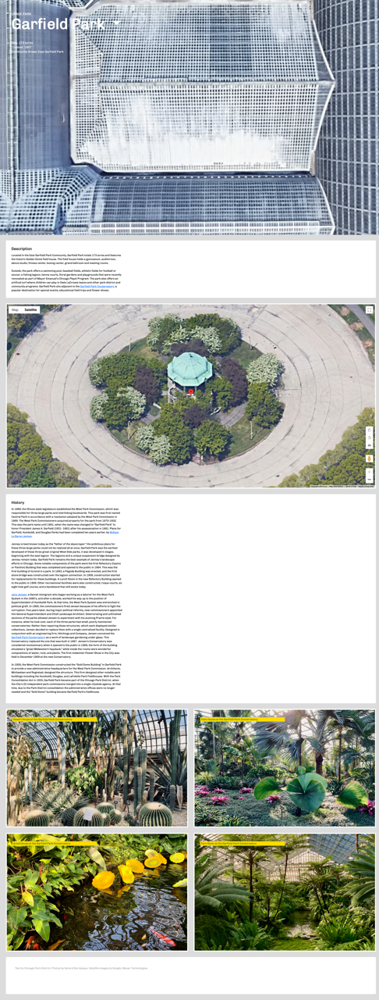
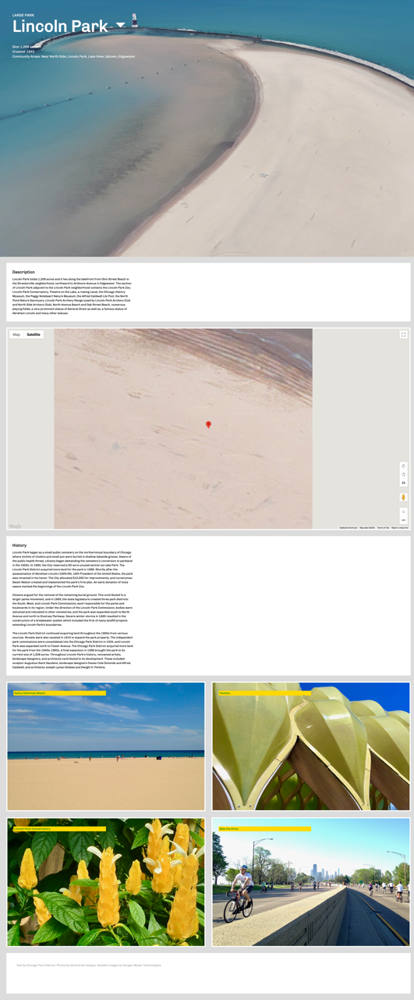

# Large Parks

A website for large public parks in Chicago

## Description

_Large Parks_ is a simple static website for large public parks overseen by the Chicago Park District.


More screenshots below.

## Disclaimer

ALL CONTENTS IN THIS REPO ARE FOR EDUCATIONAL PURPOSES ONLY.

## Getting Started

### Dependencies

* None

### Usage

Clone it!

```bash
git clone https://github.com/ggeerraarrdd/large-parks.git
```

Make sure you have [http-server](https://formulae.brew.sh/formula/http-server) installed, otherwise:

```bash
brew install http-server
```

Go into the project directory and run the command:

```bash
http-server -c-1
```

Open one of the URLs after `Available on`.

### Notes on Google Maps

For the embedded maps to work, you need to use your own API Key. Before you can create one, you will need to create a Google Cloud project, for which you need a Google Cloud account.

* [Set up a Google Cloud account](https://cloud.google.com)
* [Set up your Google Cloud project](https://developers.google.com/maps/documentation/javascript/cloud-setup)
* [Using API Keys](https://developers.google.com/maps/documentation/javascript/get-api-key)

Then replace `YOUR_API_KEY` in every .html file, except index.html, with your own.

```JavaScript
<script>(g => { var h, a, k, p = "The Google Maps JavaScript API", c = "google", l = "importLibrary", q = "__ib__", m = document, b = window; b = b[c] || (b[c] = {}); var d = b.maps || (b.maps = {}), r = new Set, e = new URLSearchParams, u = () => h || (h = new Promise(async (f, n) => { await (a = m.createElement("script")); e.set("libraries", [...r] + ""); for (k in g) e.set(k.replace(/[A-Z]/g, t => "_" + t[0].toLowerCase()), g[k]); e.set("callback", c + ".maps." + q); a.src = `https://maps.${c}apis.com/maps/api/js?` + e; d[q] = f; a.onerror = () => h = n(Error(p + " could not load.")); a.nonce = m.querySelector("script[nonce]")?.nonce || ""; m.head.append(a) })); d[l] ? console.warn(p + " only loads once. Ignoring:", g) : d[l] = (f, ...n) => r.add(f) && u().then(() => d[l](f, ...n)) })
                ({ key: "YOUR_API_KEY", v: "beta" });</script>
```

## Author(s)

* [@ggeerraarrdd](https://github.com/ggeerraarrdd/)

## Version History

### Release Notes

See [https://github.com/ggeerraarrdd/large-parks/releases](https://github.com/ggeerraarrdd/large-parks/releases)

### Initial Release

The initial release of _Large Parks_ was submitted as the solution to pset8 - Homepage of [CS50x: Introduction to Computer Science](https://cs50.harvard.edu/x/2023/) (HarvardX, 2023). Read the [assignment brief](https://cs50.harvard.edu/x/2023/psets/8/homepage/) as of May 2023.

## Future Work

No ongoing development.

## License

* [MIT License](https://github.com/ggeerraarrdd/large-parks/blob/main/LICENSE)

## Acknowledgments

* Design inspirations from the works of [Span Studio](https://span.studio/)
* For Google Maps API:
  * [Add a Google Map with a Marker to Your Website](https://developers.google.com/maps/documentation/javascript/adding-a-google-map)
  * [Call function initmap with parameters in gmaps api](https://stackoverflow.com/questions/47104164/call-function-initmap-with-parameters-in-gmaps-api)
  * [Add double quotes to string which is stored in variable](https://stackoverflow.com/questions/44795264/add-double-quotes-to-string-which-is-stored-in-variable)
* For the flexible Card UI:
  * [Solving Problems With CSS Grid and Flexbox: The Card UI](https://webdesign.tutsplus.com/tutorials/solving-problems-with-css-grid-and-flexbox-the-card-ui--cms-27468)
* For the font used for "Urbs in Hortus"
  * [Konkhmer Sleokchher](https://fonts.google.com/specimen/Konkhmer+Sleokchher) designed by Suon May Sophanith
* For writing README files
  * Curated [list](https://github.com/matiassingers/awesome-readme) of READMEs on Github
  * [How to write a good README for your GitHub project?](https://bulldogjob.com/readme/how-to-write-a-good-readme-for-your-github-project)

## Screenshots


 |  |  |
|---|---|---|
